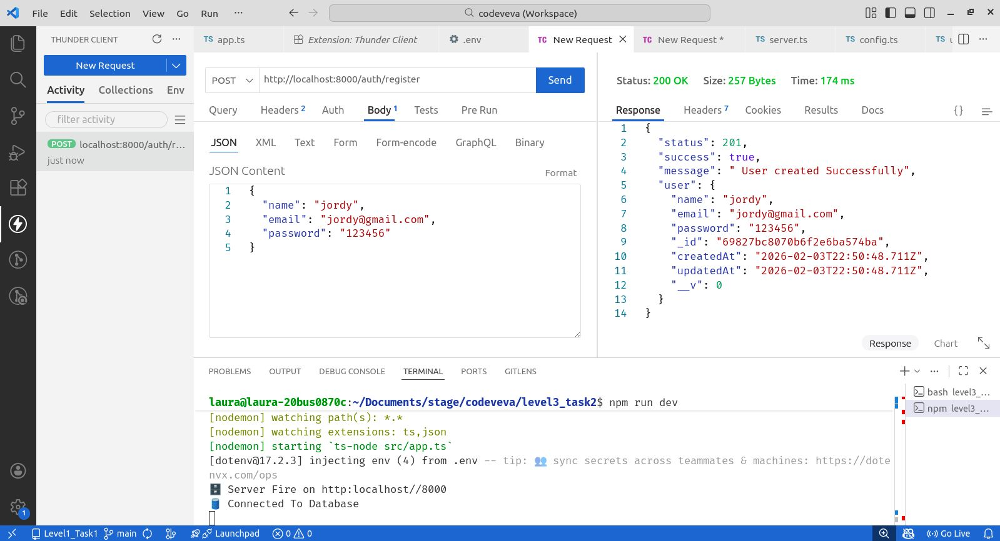
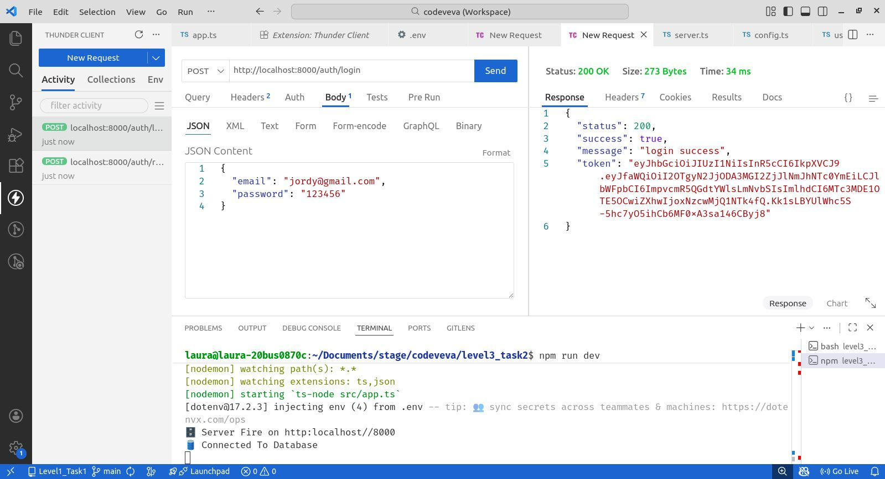
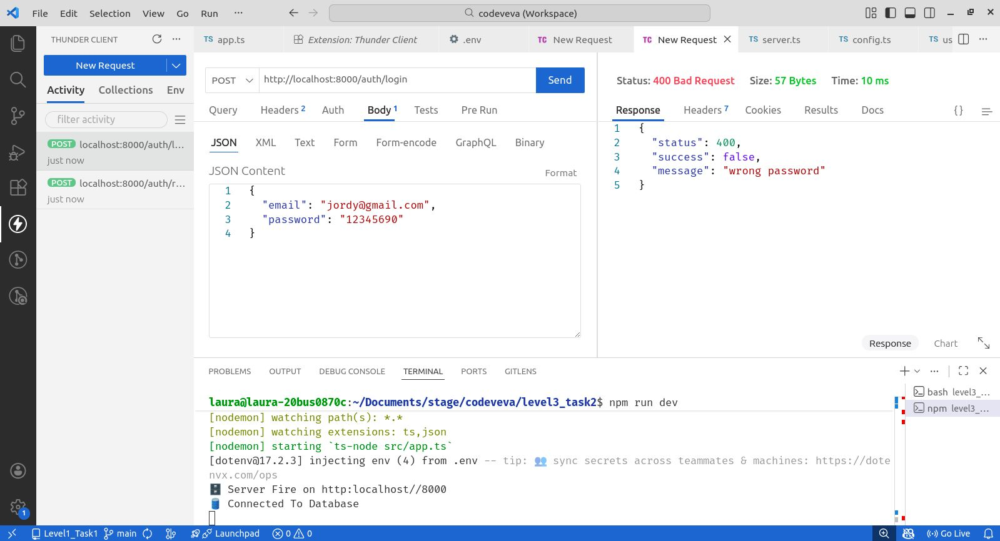
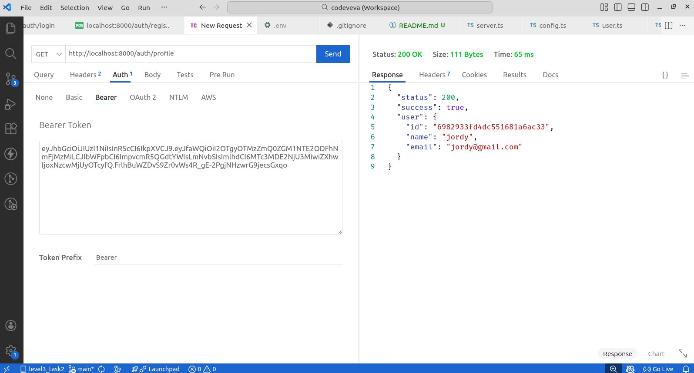
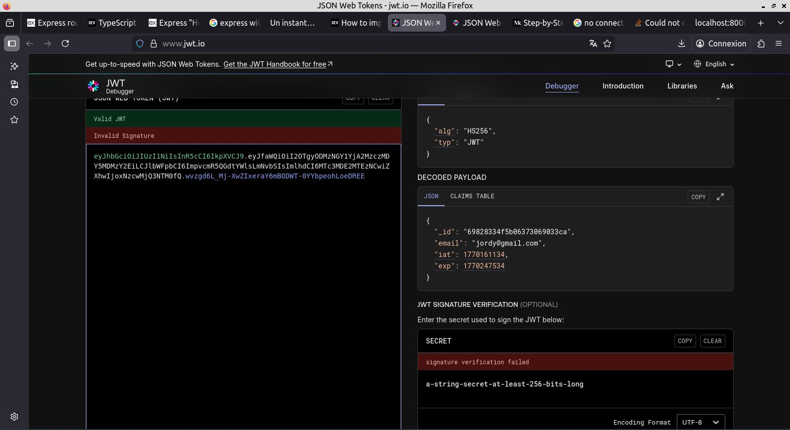
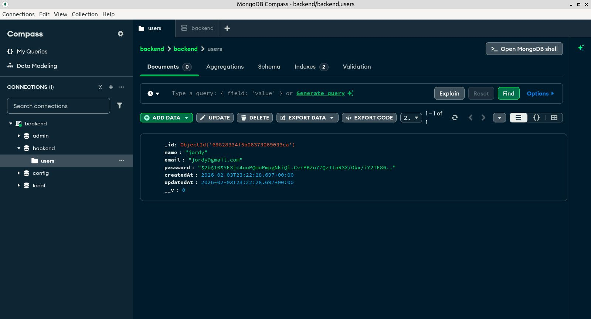

# User Authentication System with JWT

As a part of my learning journey, I developed a complete authentication system using Node.js, Express, and MongoDB. Here were the main objectives:
* Implement user registration with password hashing using bcrypt
* Create secure login functionality with JWT token generation
* Protect sensitive routes using authentication middleware
* Store user data securely in MongoDB

## Tech Stack

* **Backend**: Node.js, Express, TypeScript
* **Database**: MongoDB with Mongoose
* **Authentication**: JWT (JSON Web Tokens)
* **Security**: bcrypt for password hashing

## Features

✅ User registration with email validation  
✅ Secure password hashing (bcrypt)  
✅ JWT-based authentication  
✅ Protected routes with middleware  
✅ User profile endpoint  

## API Endpoints

### Public Routes
* `POST /auth/register` - Register a new user
* `POST /auth/login` - Login and receive JWT token

### Protected Routes
* `GET /auth/profile` - Get current user profile (requires JWT token)

## Installation
```bash
npm install
```
## Run
```bash
npm run dev
```

## Screenshots

* Register 



* Login



* Error Login



* Profile 



* JWT Decode 



* Database

